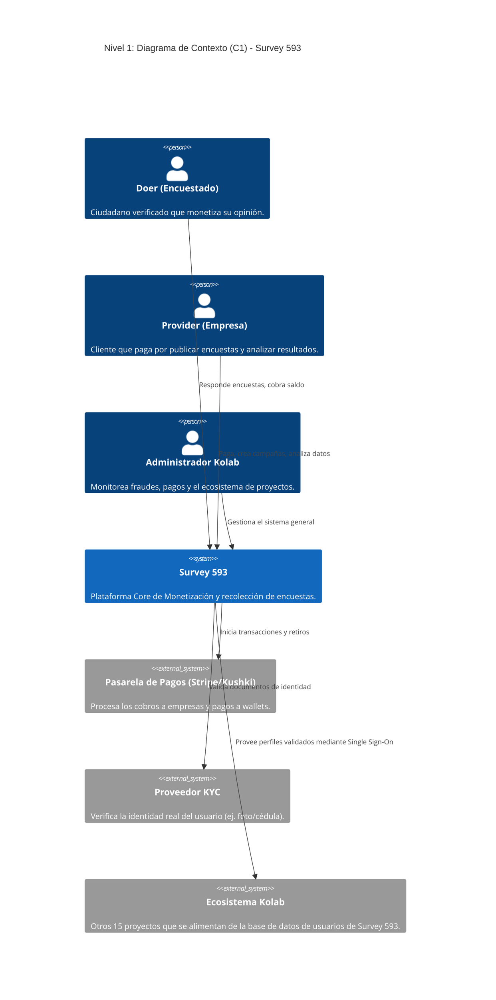
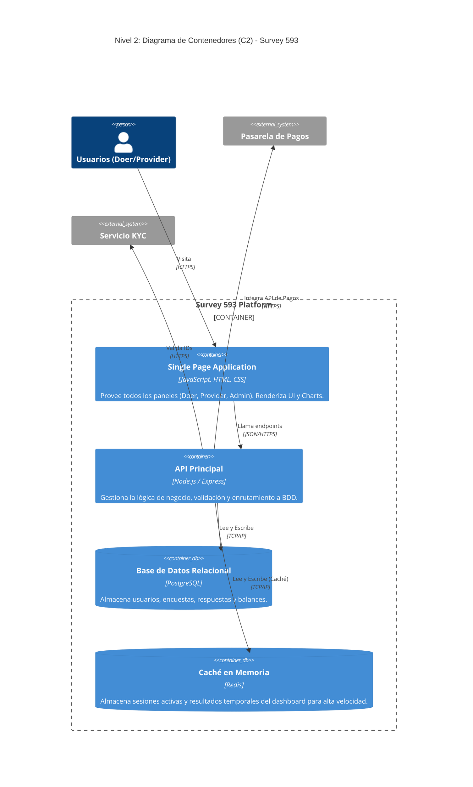
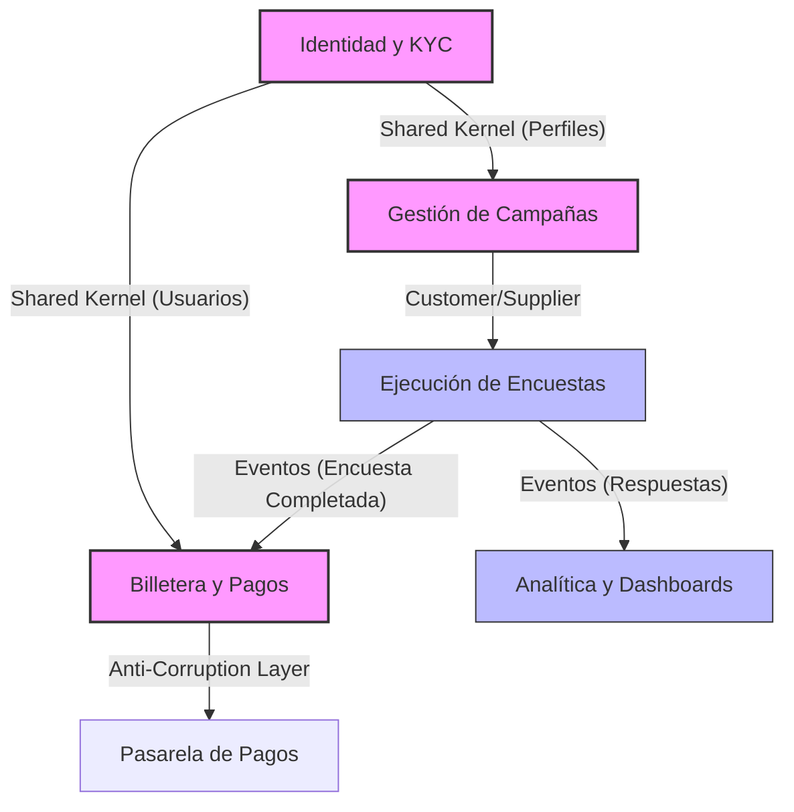
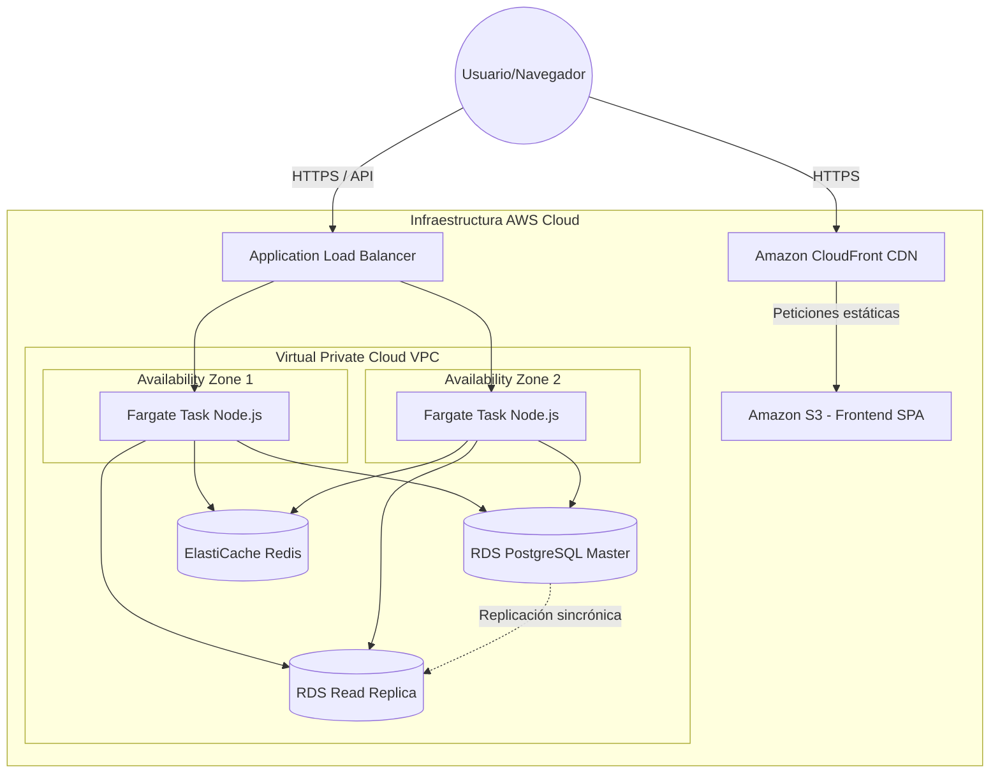

# Documento de Diseño de Arquitectura (DDA) - Survey 593

## 1. Visión General del Sistema

### Misión y Visión
**Misión:** Democratizar el acceso a datos reales y verificados, conectando directamente a las organizaciones que necesitan información estratégica con los ciudadanos dispuestos a monetizar su opinión de manera transparente y segura, eliminando el fraude en la recolección de datos.

**Visión:** Convertirnos en la plataforma líder en América Latina para la monetización de datos e investigación de mercado de fuente abierta, siendo el motor de información confiable (vendedor interno de datos) para el ecosistema tecnológico Kolab y sus futuros proyectos.

### Descripción del Problema
Actualmente, las empresas, agencias de marketing y campañas políticas gastan miles de dólares en estudios de mercado que sufren de sesgos, datos falsos, bots y tiempos de entrega excesivos. Por otro lado, los ciudadanos generan datos constantemente sin recibir ninguna retribución económica justa por ellos. Survey 593 resuelve este problema creando un puente directo: una plataforma Open SaaS donde las organizaciones obtienen *insights* reales en tiempo real, y los usuarios son compensados financieramente por cada interacción verificada.

### Ejemplo Práctico Real
**El problema:** Una cadena de supermercados (ej. Supermaxi) necesita saber por qué han bajado las ventas de productos orgánicos en Quito. Contratar una encuestadora tradicional tomaría 3 semanas y costaría $5,000, con riesgo de que las encuestas se llenen al azar.
**La solución con Survey 593:** El equipo de marketing del supermercado ingresa a su panel de "Empresa" en Survey 593, crea una campaña segmentada para "Residentes de Quito, 25-45 años", establece un presupuesto de $500 (pagando $1 por respuesta) y la publica. En cuestión de horas, 500 usuarios verificados ("Doers") desde su panel responden la encuesta.
**Resultado:** El supermercado obtiene gráficos y datos en tiempo real esa misma tarde. Los 500 usuarios reciben instantáneamente $1 en su wallet que pueden retirar a su cuenta bancaria. 

### Modelo de Negocio (¿Cómo ganan todos?)
- **Los Clientes (Empresas/Campañas):** Ganan al obtener datos reales, rápidos, altamente segmentados y libres de fraude a una fracción del costo y tiempo de un estudio tradicional.
- **Los Usuarios (Doers/Encuestados):** Ganan dinero real depositado en su wallet por el simple hecho de compartir su opinión de forma honesta, monetizando su tiempo y sus datos.
- **Los Dueños de la App (Kolab Ecosystem):** Ganan cobrando un margen de intermediación (fee de servicio) por cada encuesta publicada. Por ejemplo, si la empresa paga $1.00 por respuesta, el usuario recibe $0.70 y Kolab retiene $0.30 por procesamiento, infraestructura y validación antifraude. Además, Kolab gana una base de datos invaluable y diversificada para sus otros proyectos.

### Stakeholders (Interesados Clave)
- **Doers (Usuarios / Encuestados):** Ciudadanos verificados que responden encuestas a cambio de dinero.
- **Providers (Clientes B2B / Empresas):** Compañías, ONGs o figuras políticas que pagan por crear campañas y recopilar datos.
- **Administradores Kolab:** Equipo interno que monitorea el fraude, la calidad de datos (ARCO+), aprueba retiros y gestiona el ecosistema.
- **Dueños del Negocio:** Inversores y fundadores del Ecosistema Kolab, interesados en la rentabilidad, retención de usuarios y expansión de la plataforma.

---

## 2. Atributos de Calidad (NFRs)

Hemos priorizado tres atributos de calidad fundamentales para garantizar la integridad de los datos y la escalabilidad del negocio.

### Escenarios de Atributos de Calidad

**1. Seguridad y Anti-Fraude (Integridad de Datos)**
- **Fuente:** Usuario malintencionado (o Bot).
- **Estímulo:** Intenta registrar múltiples cuentas falsas o responder encuestas usando scripts automatizados para ganar dinero.
- **Artefacto:** Módulo de Autenticación y Motor de Calidad de Datos (ARCO+).
- **Entorno:** Sistema en operación normal.
- **Respuesta:** El sistema bloquea las peticiones automatizadas, exige verificación de identidad (KYC) antes del primer retiro, e invalida respuestas que se completen en un tiempo humanamente imposible.
- **Medida de Respuesta:** 99.9% de los intentos de fraude son mitigados, manteniendo la tasa de falsos positivos en usuarios reales por debajo del 2%.

**2. Disponibilidad**
- **Fuente:** Proveedores (Empresas).
- **Estímulo:** Acceden al dashboard para ver en tiempo real los resultados de una campaña en pleno pico de respuestas.
- **Artefacto:** API Gateway y Base de Datos de Lectura.
- **Entorno:** Alta concurrencia (Pico de tráfico).
- **Respuesta:** El sistema procesa la solicitud y devuelve los gráficos actualizados sin degradación notable.
- **Medida de Respuesta:** Disponibilidad del sistema de 99.99% (menos de 52 minutos de downtime al año). Tiempo de respuesta de lectura en el dashboard < 500ms en percentil 95.

**3. Escalabilidad (Rendimiento)**
- **Fuente:** Sistema de notificaciones / Doers.
- **Estímulo:** 10,000 usuarios intentan responder una misma encuesta simultáneamente tras recibir una notificación push.
- **Artefacto:** Balanceador de carga y Servicios de API.
- **Entorno:** Pico masivo de escritura.
- **Respuesta:** El sistema encola las respuestas temporalmente si la base de datos principal está bajo presión, escalando horizontalmente los nodos de cómputo.
- **Medida de Respuesta:** El sistema escala recursos en menos de 2 minutos. Cero pérdida de respuestas de encuestas (100% persistencia de datos validados).

### Matriz de Trade-offs

| Decisión | Atributo Beneficiado | Atributo Perjudicado (Trade-off) | Justificación |
|----------|----------------------|-----------------------------------|---------------|
| **Validación Exhaustiva (KYC) al registrar** | Seguridad (Anti-fraude) | Usabilidad (Fricción inicial) | *Sacrificamos un poco de fricción inicial en el onboarding para asegurar a nuestros clientes empresariales que el 100% de los datos son reales, que es el núcleo de nuestra propuesta de valor.* |
| **Arquitectura de Base de Datos Separada (CQRS básico)** | Rendimiento / Disponibilidad en Lectura | Consistencia (Eventual) y Costo | *Sacrificamos consistencia estricta (el dashboard de la empresa puede tener un retraso de 1-2 segundos) para que la avalancha de respuestas de los usuarios no bloquee las consultas analíticas de los clientes.* |

---

## 3. Vistas Arquitectónicas (Modelo C4)





---

## 4. Diseño Estratégico (DDD)

### Contextos Delimitados (Bounded Contexts)

1. **Contexto de Identidad y Autenticación (Core):** Maneja el registro, Single Sign-On (compartido con Kolab), roles (Doer, Provider, Admin) y el KYC (Know Your Customer).
2. **Contexto de Campañas (Core):** Toda la lógica de creación de encuestas, configuración de preguntas, segmentación del público y publicación.
3. **Contexto de Ejecución (Subdominio de Soporte):** La experiencia del usuario al responder. Controla la racha, tiempo de respuesta (anti-bots) y registro de respuestas.
4. **Contexto de Billetera/Pagos (Core):** Ledger contable interno. Maneja los depósitos de empresas, las recompensas micro-transaccionales a los usuarios y las solicitudes de retiro bancario.
5. **Contexto de Analítica (Subdominio Genérico):** Agregación de datos de las encuestas para mostrar dashboards a los providers.

### Mapa de Contexto (Context Map)



---

## 5. Interfaces y Contratos (APIs)

### Inventario de APIs Clave

| Método | Ruta | Descripción | Rol Requerido |
|--------|------|-------------|---------------|
| `POST` | `/api/v1/auth/register` | Crea un nuevo usuario en el sistema. | Ninguno |
| `POST` | `/api/v1/surveys` | Crea y lanza una nueva campaña de encuestas. | Provider |
| `GET` | `/api/v1/surveys/available` | Obtiene la lista de encuestas que aplican al perfil del usuario. | Doer |
| `POST` | `/api/v1/surveys/{id}/submit` | Envía las respuestas de una encuesta. | Doer |
| `GET` | `/api/v1/surveys/{id}/results` | Obtiene las estadísticas y respuestas agregadas. | Provider |
| `POST` | `/api/v1/wallet/withdraw` | Solicita un retiro de fondos hacia la cuenta de banco. | Doer |

### Documentación de Contrato (OpenAPI - Muestra del Recurso Clave)

Recurso Principal: **Enviar Respuesta a Encuesta**

```yaml
openapi: 3.0.0
info:
  title: Survey 593 API
  version: 1.0.0
paths:
  /api/v1/surveys/{id}/submit:
    post:
      summary: Envía respuestas a una encuesta y dispara la recompensa.
      security:
        - BearerAuth: []
      parameters:
        - in: path
          name: id
          required: true
          schema:
            type: string
          description: ID único de la encuesta
      requestBody:
        required: true
        content:
          application/json:
            schema:
              type: object
              properties:
                timeTakenSeconds:
                  type: integer
                  description: Tiempo que tardó el usuario (anti-fraude).
                answers:
                  type: array
                  items:
                    type: object
                    properties:
                      questionId:
                        type: string
                      value:
                        type: string
      responses:
        '200':
          description: Respuesta registrada y pago acreditado al wallet.
          content:
            application/json:
              schema:
                type: object
                properties:
                  status:
                    type: string
                    example: "success"
                  earnedAmount:
                    type: number
                    example: 1.50
                  newBalance:
                    type: number
                    example: 12.50
        '400':
          description: Validación fallida (ej. tiempo de respuesta inhumano = bot).
        '403':
          description: El usuario ya completó esta encuesta.
```

---

## 6. Infraestructura y Despliegue (Cloud-Native)

### Matriz de Arquitectura Cloud (AWS)

| Servicio / Componente | Elección | Justificación |
|-----------------------|----------|---------------|
| **Cómputo (API/Backend)** | AWS Fargate (Contenedores Serverless) | Permite escalar los servicios de Node.js basados en la carga (ej. cuando se envían push notifications) sin necesidad de gestionar o parchear máquinas virtuales subyacentes. |
| **Cómputo (Frontend)** | AWS S3 + CloudFront (CDN) | El Frontend (Single Page Application HTML/JS/CSS) es estático. Almacenarlo en S3 y distribuirlo vía CloudFront garantiza tiempos de carga de milisegundos en todo el mundo a un costo marginal. |
| **Datos Relacionales** | Amazon RDS para PostgreSQL | Estructura robusta para transacciones financieras (billeteras) y relaciones complejas. Soporta alta disponibilidad (Multi-AZ). |
| **Datos en Caché** | Amazon ElastiCache (Redis) | Absolutamente necesario para manejar las sesiones SSO de Kolab y acelerar el cálculo analítico de los dashboards de las empresas sin sobrecargar PostgreSQL. |
| **Estrategia de Despliegue** | Blue/Green Deployment | Al tratar con pagos y retiros de dinero real de usuarios, el riesgo de fallos en producción debe ser cero. Blue/Green permite hacer switch de tráfico instantáneo y un *rollback* inmediato si algo falla en la nueva versión. |

### Diagrama de Despliegue



---

## 7. Decisiones de Arquitectura (ADRs)

### ADR-001: Uso de Single Page Application (SPA) vs Server-Side Rendering (SSR)
- **Estado:** Aceptado.
- **Contexto:** Necesitamos interfaces altamente interactivas para responder encuestas rápidamente, construir el "wizard" de creación de encuestas y ver gráficos en tiempo real sin recargar la página.
- **Decisión:** Se construirá el sistema principal como una SPA (implementada con Vanilla JS para el prototipo y posteriormente React/Open SaaS).
- **Consecuencias:** 
  - *Pros:* Excelente experiencia de usuario (UX fluida tipo aplicación móvil), menor carga en los servidores de API que solo despachan JSON.
  - *Contras:* Mayor complejidad en la gestión del estado (ej. JWT tokens en el cliente), SEO inferior (aunque al ser una plataforma privada tras un login, el SEO profundo no es la máxima prioridad excepto en la landing page).

### ADR-002: Separación de Base de Datos de Lectura (Read Replica) para el Panel de Empresas
- **Estado:** Aceptado.
- **Contexto:** El sistema sufrirá cargas masivas (picos) cuando miles de Doers respondan encuestas al mismo tiempo. Al mismo tiempo, los Providers ejecutan consultas analíticas pesadas (sumatorias, promedios de resultados) en el dashboard que pueden bloquear la base de datos y provocar la pérdida de respuestas entrantes.
- **Decisión:** Implementar una réplica de lectura (Read Replica) en PostgreSQL específicamente para atender las consultas de los Dashboards y gráficos.
- **Consecuencias:**
  - *Pros:* La base de datos maestra (Master) se libera para enfocarse 100% en escrituras (respuestas a encuestas y pagos de billetera), asegurando alta disponibilidad durante picos.
  - *Contras:* Incrementa el costo mensual de infraestructura y añade complejidad de "consistencia eventual" (el dashboard de un cliente podría tardar 1 o 2 segundos en mostrar la respuesta más reciente). Aceptamos este *trade-off* como beneficioso para la escala comercial.

### ADR-003: Motor No-Code de Visualización Dinámica (Dashboard Studio Drag & Drop)
- **Estado:** Aceptado.
- **Contexto:** Los clientes empresariales y analistas políticos requieren tableros personalizados según su industria (salud, moda, política), variando el tipo de gráfico (Pastel, Radar/Ángulos, Barras, KPIs) y segmentaciones sin depender del equipo de desarrollo para cada cambio.
- **Decisión:** Implementar un motor de diseño declarativo con API nativa de Drag & Drop y esquema JSON (`custom_dashboards`) que vincula automáticamente componentes visuales a cualquier pregunta de la base de datos relacional.
- **Consecuencias:**
  - *Pros:* Empodera al cliente (Self-service Analytics / No-Code BI), reduce tickets de soporte técnico al 0% para personalización de reportes, y otorga una ventaja competitiva masiva frente a software de encuestas tradicional.
  - *Contras:* Requiere validar la compatibilidad de tipos de preguntas con tipos de gráficos en el cliente (ej. un campo de texto abierto no puede mapearse directamente a un gráfico de pastel).

---

## 8. Estrategia de Calidad y Pruebas (QA & Testing)

Para garantizar la robustez del sistema financiero y la recolección de datos, se define el siguiente stack de aseguramiento de calidad (QA):

| Tipo de Prueba | Herramienta / Software | Objetivo y Alcance |
|----------------|------------------------|---------------------|
| **Pruebas End-to-End (E2E)** | **Playwright** / **Cypress** | Automatización visual del flujo completo: registro, arrastre de widgets en el Dashboard Studio, respuesta de encuestas y solicitud de retiro de fondos en el wallet. Graba video y captura pantallas de fallos. |
| **Pruebas Unitarias & Integración** | **Vitest** / **Jest** + **Testing Library** | Validación de cálculos matemáticos en el wallet (balances, fees de Kolab), cálculo de promedios Likert y validación de esquemas de datos. |
| **Pruebas de Contrato & API** | **Postman** / **Bruno** / **Thunder Client** | Validación automatizada de los contratos OpenAPI/Swagger, códigos de estado HTTP (200, 400, 401, 403, 500) y tiempos de respuesta. |
| **Pruebas de Carga & Estrés** | **k6 (Grafana k6)** | Simulación de picos masivos de tráfico (ej. 5,000 Doers enviando respuestas concurrentemente) para verificar que el auto-scaling de AWS Fargate responda en menos de 2 minutos. |

---

## 9. Hoja de Ruta Tecnológica: Transición a Framework de Producción

Para la fase de producción con desarrolladores novatos / juniors, se seleccionó la siguiente arquitectura optimizada para curva de aprendizaje rápida y alta productividad:

- **Frontend:** **React + Vite + Tailwind CSS + Shadcn UI** (o **Open SaaS / Wasp**).
  - *¿Por qué NO Angular?* Angular tiene una curva de aprendizaje muy pronunciada (RxJS, Inyección de dependencias compleja, TypeScript estricto) que abruma a programadores principiantes. React con hooks funcionales (`useState`, `useEffect`) es mucho más intuitivo y cuenta con el mayor ecosistema para Drag & Drop (`dnd-kit`, `react-grid-layout`).
- **Base de Datos & Backend:** **Supabase (PostgreSQL Cloud)** o **Firebase Firestore**.
  - *Recomendación Principal:* **Supabase (PostgreSQL)**, ya que provee Autenticación, Base de datos relacional con integridad transaccional para wallets, y APIs REST/Realtime generadas automáticamente sin necesidad de programar un backend complejo desde cero.
