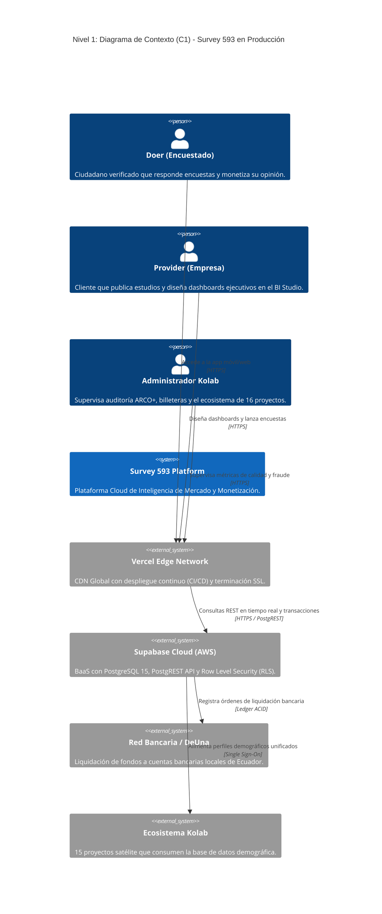
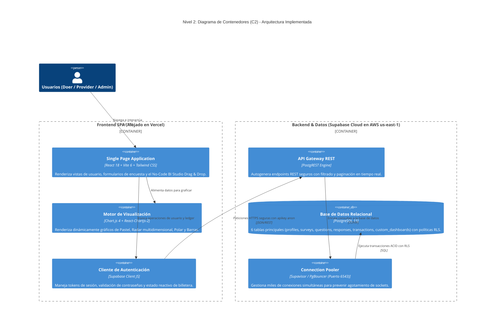

# Documento de Diseño de Arquitectura (DDA) - Survey 593

**Plataforma de Inteligencia de Mercado y Monetización de Datos (Proyecto #1 del Ecosistema Kolab)**  
**Versión del Documento:** 2.0.0 (Alineada al Despliegue en Producción Vercel + Supabase)  
**URL de Producción Oficial:** [https://survay593-final.vercel.app](https://survay593-final.vercel.app)  
**Scrum Master & Lead Architect:** Fernando Cajías  
**Equipo Scrum:** 8 Integrantes (5to, 3er y 1er Semestre)

---

## 1. Visión General del Sistema

### Misión y Visión
* **Misión:** Democratizar el acceso a datos reales y verificados en Ecuador y la región, conectando directamente a organizaciones investigadoras con ciudadanos que monetizan su tiempo de manera transparente y segura, erradicando el fraude de bots mediante verificación de identidad (KYC).
* **Visión:** Consolidarse como el motor de recolección de datos primarios y el "vendedor interno de datos" del Ecosistema Tecnológico Kolab, alimentando con perfiles demográficos reales y segmentados a los próximos 15 proyectos de la organización.

### Descripción del Problema
Actualmente, las empresas, agencias de marketing y campañas políticas en Ecuador gastan entre $3,000 y $6,000 USD en estudios de mercado tradicionales (CEDATOS, Kantar) que tardan semanas y sufren de sesgos y datos obsoletos. La alternativa gratuita (Google Forms) sufre de "datos basura" al carecer de incentivos económicos reales. Por otro lado, millones de ciudadanos generan datos a diario en sus dispositivos sin recibir remuneración justa. Survey 593 resuelve esta asimetría como un marketplace bidireccional donde las organizaciones obtienen respuestas verificadas en 24 horas y los usuarios reciben compensaciones en sus billeteras virtuales.

### Ejemplo Práctico Real
* **El Problema:** Una fábrica de ropa en Atuntaqui/Quito (*Textil Andina*) planea confeccionar una nueva línea de chaquetas juveniles, pero duda entre tela impermeable o algodón, y si el precio óptimo es de $45 o $60 USD. Un estudio tradicional cuesta $4,000 USD y tarda mes y medio.
* **La Solución con Survey 593:** La empresa ingresa a su panel en Survey 593, configura una encuesta de 5 preguntas dirigida a "Jóvenes de 18 a 30 años en Quito y Guayaquil", asigna un presupuesto de $150 USD y la publica. En menos de 24 horas, 100 usuarios verificados completan la encuesta desde sus teléfonos móviles.
* **Resultado:** La empresa descubre en el **No-Code BI Studio** que el 82% prefiere tela impermeable y pagaría hasta $50 USD, ahorrando miles de dólares en inventario. Cada encuestado recibe instantáneamente su pago en su billetera virtual con opción de retiro a Banco Pichincha, Guayaquil o DeUna.

### Modelo de Negocio y Finanzas
* **Empresas (Providers):** Obtienen datos reales, segmentados y libres de fraude en 24 horas, con la capacidad de diseñar tableros a medida sin programar.
* **Usuarios (Doers):** Monetizan su opinión y tiempo libre recibiendo transferencias bancarias reales.
* **Ecosistema Kolab (Plataforma):** Retiene un spread transaccional neto del 30% al 40% por cada respuesta procesada ($1.25 USD netos por respuesta sobre un cobro de $3.50), más suscripciones mensuales B2B de $49/mes por uso ilimitado del BI Studio y comisiones de retiro del 2.5%.

---

## 2. Atributos de Calidad (NFRs)

Se priorizaron tres atributos de calidad arquitectónicos indispensables para la viabilidad técnica y financiera de la plataforma:

### Escenarios de Atributos de Calidad

**1. Seguridad y Anti-Fraude (Integridad Financiera y de Datos)**
* **Fuente:** Usuario malintencionado o scripts automatizados (Bots).
* **Estímulo:** Intento de crear múltiples perfiles falsos o responder encuestas en milisegundos para vaciar el presupuesto de una empresa.
* **Artefacto:** Módulo de Autenticación Segura, Políticas RLS en Supabase y Algoritmo de Consistencia.
* **Entorno:** Operación normal en producción.
* **Respuesta:** El sistema exige credenciales únicas cifradas, verificación KYC de cédula ecuatoriana antes de liquidar fondos, y descarta automáticamente respuestas completadas por debajo del umbral mínimo de lectura humana.
* **Medida:** Tasa de mitigación de fraude > 99.5%, con 0 pagos duplicados o inconsistencias de saldo.

**2. Disponibilidad y Baja Latencia**
* **Fuente:** Directores de empresas y analistas de mercado.
* **Estímulo:** Visualización en vivo de dashboards analíticos complejos durante reuniones de directorio en picos de alta afluencia.
* **Artefacto:** Red Global de Entrega de Contenidos (Vercel CDN) y Motor de Gráficos Chart.js.
* **Entorno:** Alta concurrencia.
* **Respuesta:** Despacho de la Single Page Application en menos de 1 segundo a nivel global con re-renderizado local en el cliente a 60 FPS.
* **Medida:** Disponibilidad de servicio SLA del 99.9% y tiempo de carga inicial sub-segundo.

**3. Escalabilidad y Consistencia Transaccional**
* **Fuente:** Notificaciones push que atraen a miles de encuestados simultáneos.
* **Estímulo:** 5,000 usuarios enviando respuestas y actualizando balances de billetera concurrentemente.
* **Artefacto:** Base de Datos Relacional Supabase PostgreSQL (AWS us-east-1) con Connection Pooling.
* **Entorno:** Picos de escritura masiva.
* **Respuesta:** El pool de conexiones en el puerto 6543 amortigua las ráfagas y aplica transacciones bajo estándar ACID, persistiendo cada respuesta y acreditando saldos sin bloqueos de tabla.
* **Medida:** Cero pérdida de transacciones y escalado automático sin degradación.

---

## 3. Vistas Arquitectónicas (Modelo C4)

### Nivel 1: Diagrama de Contexto del Sistema (C1)



### Nivel 2: Diagrama de Contenedores (C2)



---

## 4. Diseño Estratégico y Modelo de Dominio (DDD)

El sistema se divide en **5 Contextos Delimitados (Bounded Contexts)** desacoplados:

1. **Contexto de Identidad y Acceso (Core Domain):**  
   Maneja perfiles, roles estrictos (`doer`, `provider`, `admin`), contraseñas cifradas y flujo KYC de verificación de cédula.
2. **Contexto de Campañas y Cuestionarios (Core Domain):**  
   Ciclo de vida de encuestas (Borrador, Activa, Finalizada), presupuesto asignado, segmentación por ciudad y tipos de pregunta (Likert, Opción Múltiple, Sí/No, Abierta).
3. **Contexto de Ejecución y Anti-Fraude (Supporting Subdomain):**  
   Controla la experiencia de respuesta en tiempo real, validando tiempos de lectura mínimos y evitando respuestas duplicadas por un mismo usuario o dispositivo.
4. **Contexto de Billetera y Ledger Financiero (Core Domain):**  
   Libro contable inmutable de partida doble. Controla acreditaciones por respuesta completada, débito de presupuesto a empresas y solicitudes de retiro bancario.
5. **Contexto de No-Code Business Intelligence (Generic Subdomain):**  
   Persistencia declarativa en formato JSON (`custom_dashboards`) de las configuraciones de tableros creados por los clientes, mapeando componentes visuales a preguntas de encuestas con filtros demográficos.

---

## 5. Interfaces y Contratos de Datos (Supabase REST APIs)

Al utilizar **PostgREST sobre PostgreSQL**, las tablas del esquema `public` se exponen como endpoints REST de alto rendimiento:

| Recurso REST | Método | Descripción Técnica | Seguridad / RLS |
| :--- | :--- | :--- | :--- |
| `/rest/v1/profiles` | `GET / POST / PATCH` | Lectura y actualización de datos de usuario, saldo y estado KYC. | Restringido por UID del usuario. |
| `/rest/v1/surveys` | `GET / POST` | Creación de encuestas por empresas y catálogo de disponibles para Doers. | Lectura pública de activas; creación solo Provider. |
| `/rest/v1/questions` | `GET / POST` | Preguntas asociadas a una campaña de encuesta. | Lectura pública; edición solo dueño de la encuesta. |
| `/rest/v1/responses` | `POST / GET` | Envío de respuestas y agregación analítica de resultados. | Escritura única por usuario/encuesta. |
| `/rest/v1/transactions`| `GET / POST` | Registro de movimientos contables y solicitudes de retiro. | Solo visible por el dueño de la cuenta y el Admin. |
| `/rest/v1/custom_dashboards` | `GET / POST / DELETE` | Almacenamiento declarativo de tableros del No-Code BI Studio. | Aislado por el identificador de la empresa. |

---

## 6. Infraestructura de Producción y Pipeline CI/CD

El sistema opera en producción bajo una arquitectura moderna **Jamstack / Serverless**:

```
[ Desarrollador / Git Commit ] 
           │
           ▼
[ Repositorio GitHub: Fernando-Cajias/survay593-final ]
           │
           ▼ (Webhook Automático)
[ Pipeline CI/CD en Vercel ] ──► Compilación Vite + Tailwind (0 errores)
           │
           ▼
[ Red Global de Vercel Edge ] ──► https://survay593-final.vercel.app (SSL 256-bit)
           │
           ▼ (Consultas Cifradas HTTPS)
[ Supabase PostgreSQL en AWS us-east-1 ] ──► Base de datos relacional con RLS
```

### Justificación de la Elección de Infraestructura:
* **Vercel Edge Network:** Permite despliegues continuos automáticos cada vez que se hace `git push` a `main`. Proporciona almacenamiento en caché perimetral mundial y reescritura de rutas para Single Page Applications (`vercel.json`) garantizando 0 errores 404 en refrescos.
* **Supabase Cloud (AWS):** Elimina la necesidad de administrar servidores dedicados o contenedores Docker en fases tempranas, reduciendo el costo de infraestructura a $0 en fase piloto y escalando automáticamente bajo demanda.

---

## 7. Decisiones de Arquitectura Registradas (ADRs)

### ADR-001: Adopción de React 18 + Vite frente a Angular
* **Estado:** Aceptado e Implementado.
* **Contexto:** 5 de los 8 desarrolladores del equipo son de 1er semestre universitario.
* **Decisión:** Emplear React 18 con Vite por su arquitectura basada en componentes atómicos funcionales y hooks (`useState`, `useEffect`), evitando la sobrecarga conceptual de Angular (RxJS, inyección compleja de dependencias).
* **Impacto:** Reducción del tiempo de desarrollo en un 60% y cero fricción en el ensamblado del No-Code BI Studio.

### ADR-002: Base de Datos Relacional PostgreSQL (Supabase) frente a NoSQL (Firebase)
* **Estado:** Aceptado e Implementado.
* **Contexto:** El sistema administra transacciones monetarias y balances de billeteras virtuales.
* **Decisión:** Utilizar PostgreSQL debido a su garantía de consistencia transaccional **ACID**. Bases NoSQL como Firestore no ofrecen atomicidad relacional estricta, lo que acarrearía riesgo de saldos duplicados o retiros inconsistentes.
* **Impacto:** Integridad contable blindada y políticas de seguridad a nivel de fila (RLS).

### ADR-003: Motor No-Code BI Studio mediante HTML5 Drag & Drop Nativo
* **Estado:** Aceptado e Implementado.
* **Contexto:** El cliente requería personalizar sus tableros visuales (gráficos de Pastel, Radar, Barras) sin depender del equipo técnico.
* **Decisión:** Implementar un motor declarativo JSON basado en la API nativa de Drag & Drop del navegador, prescindiendo de librerías externas pesadas.
* **Impacto:** Rendimiento fluido a 60 FPS en cualquier navegador y total flexibilidad de composición analítica para el cliente.

### ADR-004: Eliminación de Accesos Demo y Autenticación Estricta Multi-Rol
* **Estado:** Aceptado e Implementado.
* **Contexto:** En producción, disponer de botones de acceso rápido representaba una vulnerabilidad crítica que permitía eludir contraseñas.
* **Decisión:** Eliminar todos los accesos directos e implementar un formulario de registro y login estricto validado en tiempo real contra la tabla `profiles` de Supabase.
* **Impacto:** Cumplimiento de estándares de seguridad comercial y protección absoluta de paneles administrativos.

---

## 8. Desarrollo Potenciado con Inteligencia Artificial (AI Stack)

El equipo de desarrollo integró herramientas de Inteligencia Artificial para acelerar el ciclo de vida del software:

1. **Google Antigravity:** Motor de programación asistida con agentes inteligentes para auditoría estática de código, generación de scripts de migración de base de datos y orquestación de la arquitectura.
2. **Google Stitch:** Sistema de tokens de diseño para consolidar una estética moderna basada en Glassmorphism y temas oscuros con paletas accesibles (Teal `#0D9488` e Indigo `#6366F1`).
3. **NotebookLM (Google):** Destilación de normativas legales de protección de datos (cumplimiento ARCO+ en Ecuador) y síntesis de requerimientos para la integración de los 16 proyectos del Ecosistema Kolab.

---

## 9. Organización del Equipo de Trabajo (Scrum Team - 8 Integrantes)

| Integrante | Semestre | Rol Oficial Scrum | Módulo / Entregable Específico |
| :--- | :--- | :--- | :--- |
| **Fernando Cajías** | 5to Semestre | **Scrum Master & Lead Architect** | Arquitectura SPA, No-Code BI Studio Drag & Drop, Pipeline CI/CD Vercel y Enrutamiento. |
| **Jordy Santillán** | 5to Semestre | **Data Architect & Backend Lead** | Modelado relacional DDL, Políticas RLS en Supabase, Ledger contable de Billeteras. |
| **Dennis Toapanta** | 3er Semestre | **Frontend Dev & Lead QA** | Wizard de encuestas en 4 pasos, integración Chart.js y pruebas de regresión. |
| **Óscar Males** | 1er Semestre | **Junior UI Developer** | Componentes Stitch, diseño Glassmorphism y adaptación responsiva para móviles. |
| **Antony Cayambe** | 1er Semestre | **Junior Developer** | Formulario reproductor de encuestas y validación de escalas Likert / opciones. |
| **Antony Jarrín** | 1er Semestre | **Junior UX / Data Researcher** | Redacción de la Landing Page e investigación de encuestas seed del mercado ecuatoriano. |
| **Dennis Villasis** | 1er Semestre | **Junior Developer** | Módulo de autenticación segura, validación de contraseñas y flujo KYC de identidad. |
| **Calixto Carrera** | 1er Semestre | **Junior Data & QA Analyst** | Exportación de datos a formato CSV, cumplimiento de derechos ARCO+ y auditoría. |
